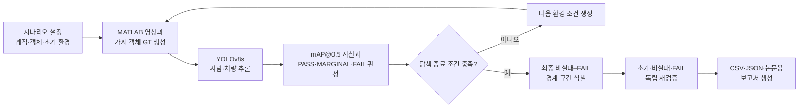

# Counterfactual XAI Verifier

무인항공기(UAV) 객체 탐지 모델이 안개·조도·카메라 잡음 변화로 성능 기준을 위반하는 구간을 자동으로 찾고, 그 과정을 재현 가능한 실험 자료로 남기는 프로젝트이다. 이 README는 `kci` 브랜치의 최종 검증 경로를 기준으로 작성되었다.

최종 실험은 **기존 MATLAB 시뮬레이션 환경**, **다양화된 합성자료로 재학습한 YOLOv8s**, **대칭 이분 탐색**을 연결한다. 결과는 실제 비행환경의 성능 보장이 아니라, 고정된 합성 시나리오에서 관측한 기술적 경계 구간이다.

## 1. 프로젝트 개요

일반적인 시험은 미리 고른 몇 개 환경에서 모델이 성공했는지 실패했는지만 확인한다. 이 프로젝트는 정상 조건에서 시작해 환경을 단계적으로 악화시키고, 최초 FAIL이 발견되면 비실패 조건과 FAIL 조건의 중간값을 반복 평가하여 두 조건 사이를 좁힌다.

여기서 사용하는 주요 용어는 다음과 같다.

- **정답 상자(Ground Truth, GT)**: 영상에서 실제로 보이는 사람·차량의 위치를 나타내는 사각형이다.
- **mAP@0.5**: 예측 상자와 정답 상자의 IoU가 0.5 이상일 때 클래스별 AP를 구하고, 사람과 차량 AP의 평균을 계산한 탐지 성능 지표이다.
- **비실패 조건**: PASS 또는 MARGINAL로 판정된 환경 조건이다.
- **경계 구간**: 마지막 비실패 조건과 마지막 FAIL 조건 사이의 구간이다. 하나의 정확한 실패점으로 해석하지 않는다.

이 저장소의 최종 고정 원칙은 다음과 같다.

> 이 시점 이후 S0~S4 또는 신규 시험 결과를 보고 가중치, 판정 기준, 탐색 방법 및 환경 범위를 변경하지 않는다.

## 2. 핵심 기능

- MATLAB 기반 UAV 궤적, 지형, 사람·차량 및 640×360 EO 영상 생성
- 별도 인스턴스 색상 렌더 패스로 실제 보이는 픽셀만 사용한 GT 상자 생성
- 다양화된 합성자료로 재학습한 YOLOv8s의 사람·차량 탐지
- 클래스별 AP@0.5와 mAP@0.5 계산
- PASS·MARGINAL·FAIL 판정
- 최초 FAIL 전 공통 환경 열화와 최초 FAIL 후 50:50 대칭 중간값 탐색
- 마지막 비실패·FAIL 사례 저장과 원래 탐색 캐시를 사용하지 않는 독립 재검증
- CSV·JSON·Markdown 표, 감사 자료 및 논문용 4장·5장 문안 생성
- 설정·가중치·계획·결과 파일의 SHA-256 기록

SHAP 및 비대칭 탐색 관련 코드는 저장소에 남아 있지만, 이 README의 최종 T0~T2 결과와 우월성 주장에는 사용하지 않는다.

## 3. 전체 처리 과정



MATLAB은 영상과 GT를 만들고, YOLOv8s는 각 프레임에서 사람과 차량을 탐지한다. Python 평가 코드는 전체 프레임의 탐지 결과로 mAP@0.5를 계산하고 다음 환경을 선택한다. 탐색 정책은 모델 학습과 분리되어 있으며 T0~T2 결과를 본 뒤 가중치나 기준을 바꾸지 않는다.

## 4. 판정 및 탐색 기준

### 판정 기준

| 판정 | 정확한 조건 | 경계 탐색에서의 역할 |
|---|---|---|
| PASS | `mAP@0.5 >= 0.50` | 비실패 앵커 갱신 |
| MARGINAL | `0.25 <= mAP@0.5 < 0.50` | 비실패 앵커 갱신 |
| FAIL | `mAP@0.5 < 0.25` | FAIL 앵커 갱신 |

0.50은 PASS이고 0.25는 MARGINAL이다. PASS와 MARGINAL은 탐색에서 모두 비실패 조건으로 처리한다.

### 초기 조건과 환경 범위

| 변수 | 초기값 | 허용 범위 | 저장 정밀도 |
|---|---:|---:|---:|
| 안개 `fog_percent` | 5% | 0~100% | 소수점 2자리 |
| 조도 `illumination_lux` | 12,000 lx | 200~15,000 lx | 소수점 1자리 |
| 카메라 잡음 `camera_noise` | 0.02 | 0~0.6 | 소수점 4자리 |

시나리오당 최대 평가 횟수는 10회이다. 초기 정상조건이 PASS가 아니면 시나리오를 수정하지 않고 탐색 미실시로 기록한다.

### 다음 환경 선택

최초 FAIL 전에는 현재 환경을 다음과 같이 동시에 악화시킨 뒤 허용 범위로 제한한다.

```text
fog_next   = fog_current + 30 percentage points
lux_next   = lux_current × 0.50
noise_next = noise_current + 0.20
```

최초 FAIL 후에는 마지막 비실패 앵커 `E_nonfail`과 마지막 FAIL 앵커 `E_fail`의 성분별 50:50 중간값을 선택한다.

```text
E_next = clamp_and_round(0.50 × E_nonfail + 0.50 × E_fail)
```

### 경계 간격

`Gap_mAP`은 마지막 비실패와 FAIL의 mAP 차이이다.

```text
Gap_mAP = |mAP_nonfail - mAP_fail|
```

`Gap_env`는 세 환경변수 차이를 각각 전체 허용 범위로 정규화한 뒤 **합산**한 값이다. 평균이 아니다.

```text
Gap_env = |Δfog| / 100 + |Δlux| / 14,800 + |Δnoise| / 0.6
```

실제 구현은 [search_core.py](experiments/yolov8_search_comparison/search_core.py), 최종 설정은 [evaluation_config.json](experiments/yolov8_search_comparison/final_kci_verification/config/new_fixed_tests_t0_t2_v2/evaluation_config.json)에서 확인할 수 있다.

## 5. 저장소 구조

아래는 최종 KCI 재현에 직접 필요한 경로만 정리한 것이다.

```text
Counterfactual-XAI-Verifier/
├── eo_camera_3d_render.m                 # 데이터 생성: 3D EO 영상·인스턴스 색상 렌더
├── render_eo_image.m                     # 데이터 생성: 안개·조도·잡음을 반영한 영상 생성
├── mountain_uav_model.slx                # 데이터 생성: 원 UAV Simulink 모델
├── requirements.txt                      # 설치: Python 기본 의존성
└── experiments/yolov8_search_comparison/
    ├── search_core.py                    # 경계 탐색: 판정·환경 선택·AP·Gap 계산
    ├── run_comparison.py                 # 기준 성능 검증: YOLO 추론·공통 평가 저장소
    ├── tests/                            # 자동 검증: 공통 탐색·GT·클래스 매핑 테스트
    ├── diverse_training_scenario_split/
    │   ├── plan.py                       # 데이터 생성: 학습 18·검증 5 시나리오 사전 등록
    │   ├── prepare_dataset.py            # 데이터 생성: 렌더 자료 포장·GT·중복 감사
    │   ├── train_diverse.py              # 모델 학습: YOLOv8s 학습·내부 검증
    │   ├── configure_evaluation.py       # 기준 성능 검증: 고정 가중치 평가 설정 생성
    │   ├── report_and_validate.py        # 결과 시각화·자동 검증: S0~S4 표·그림·보고서
    │   └── tests/                        # 자동 검증: 자료 분할·다양화 조건 테스트
    ├── multi_scenario_symmetric/
    │   ├── prepare_scenarios.py          # 데이터 생성: 기존 S0~S4 계획·GT 검사
    │   ├── run_experiment.py             # 경계 탐색: S0~S4 대칭 탐색 공통 실행기
    │   ├── reverify_cases.py             # 재검증: S0~S4 경계 사례 재추론
    │   ├── report_results.py             # 결과 시각화: S0~S4 표·PNG 생성
    │   ├── validate_outputs.py           # 자동 검증: S0~S4 산출물 검사
    │   └── tests/                        # 자동 검증: 다중 시나리오 테스트
    └── final_kci_verification/
        ├── lock_experiment.py            # 자동 검증: 최종 조건·해시 고정
        ├── new_fixed_tests_v2.py         # 데이터 생성: T0~T2 v2 등록·사전검사
        ├── run_t0_t2.py                  # 경계 탐색: 초기평가와 최대 10회 대칭 탐색
        ├── revalidate_t0_t2.py           # 재검증: 고정 9조건 새 렌더·추론
        ├── report_t0_t2.py               # 논문용 결과: CSV·JSON·4장·5장 생성
        ├── config/                        # 고정 설정·시나리오 계획
        └── outputs/                       # 최종 감사·집계·재검증·논문 문안
```

`diverse_training_scenario_split_v1`, `new_fixed_tests_t0_t2_v1`, 이름에 다른 시각이 포함된 실행 폴더는 실패 기록 또는 과거 실행을 보존하기 위한 감사 자료이다. 최종 경로는 다음 두 ID로 구분한다.

- 최종 학습·검증 계획: `diverse_training_scenario_split_v2`
- 최종 T0~T2 계획: `new_fixed_tests_t0_t2_v2`
- 대표 T0~T2 실행 세션: `kci_new_fixed_tests_t0_t2_v2__20260903_160812_371388`

과거 폴더를 최종 결과로 인용하거나 삭제·이동하지 않는다.

## 6. 요구 환경

최종 실행 고정 문서에서 확인한 환경은 다음과 같다.

| 구분 | 확인된 값 | 비고 |
|---|---|---|
| 운영체제 | Windows 10.0.19045 64-bit | 최종 실행 환경 |
| CPU | Intel Core i5-11400 | 6코어/12스레드 |
| RAM | 15.84 GiB | 17,009,278,976 bytes |
| GPU | NVIDIA GeForce RTX 2060 | 6,144 MiB, driver 591.59 |
| MATLAB | R2025b Update 4 | 25.2.0.3150157 |
| Python | 3.11.9 | 64-bit |
| PyTorch | 2.5.1+cu121 | CUDA runtime 12.1 |
| cuDNN | 90100 | 최종 실행 기록 |
| Ultralytics | 8.4.46 | YOLOv8s 학습·추론 |
| 렌더 영상 | 640×360 PNG | 프레임 간격 0.1초 |
| YOLO 입력 크기 | 640 | 추론 batch 16 |

코드에서 직접 확인한 MATLAB 구성요소는 다음과 같다.

- MATLAB Engine API for Python: Python에서 MATLAB 렌더 함수를 호출할 때 필요
- Simulink: `mountain_uav_model.slx`를 다시 실행하거나 `geometry_reference_v1.mat`을 재생성할 때 필요
- Image Processing Toolbox: `eo_camera_3d_render.m`의 `imresize` 사용에 필요
- 그 밖의 MATLAB 도구상자: 저장된 제품 목록만으로 필수 여부를 확정할 수 없어 **확인 필요**

핵심 Python 코드는 `numpy`, `torch`, `ultralytics`, `Pillow`, `PyYAML`, `psutil`, `matplotlib`을 직접 사용한다. `psutil`, `PyYAML`, MATLAB Engine은 현재 `requirements.txt`에 명시적으로 고정되어 있지 않으므로 별도 확인이 필요하다.

## 7. 설치 방법

### Windows PowerShell

```powershell
git clone --branch kci https://github.com/JJUNHYEOK/Counterfactual-XAI-Verifier.git
Set-Location Counterfactual-XAI-Verifier

py -3.11 -m venv .venv
.\.venv\Scripts\Activate.ps1
python -m pip install --upgrade pip
python -m pip install -r requirements.txt
python -m pip install psutil PyYAML
```

MATLAB R2025b의 `bin` 디렉터리를 `PATH`에 추가하고, 설치된 MATLAB 릴리스와 호환되는 MATLAB Engine for Python을 MathWorks 설치 절차에 따라 구성한다. 다음 명령으로 연결 상태를 확인한다.

```powershell
matlab -batch "disp(version)"
python -c "import matlab.engine; print('MATLAB Engine import: OK')"
python -c "import torch, ultralytics; print(torch.__version__, torch.version.cuda, ultralytics.__version__, torch.cuda.is_available())"
```

### Bash

MATLAB과 CUDA를 지원하는 환경이라면 Python 부분은 다음과 같이 구성할 수 있다. 다만 최종 실행에서 확인된 운영체제는 Windows 10뿐이다.

```bash
git clone --branch kci https://github.com/JJUNHYEOK/Counterfactual-XAI-Verifier.git
cd Counterfactual-XAI-Verifier

python3.11 -m venv .venv
source .venv/bin/activate
python -m pip install --upgrade pip
python -m pip install -r requirements.txt
python -m pip install psutil PyYAML

matlab -batch "disp(version)"
python -c "import matlab.engine; print('MATLAB Engine import: OK')"
```

### 가중치와 설정

평가에는 다음 최종 가중치가 필요하다.

```text
experiments/yolov8_search_comparison/diverse_training_scenario_split/training/diverse_training_scenario_split_v2/diverse_yolov8s_seed42__20260903_010327_583537/weights/best.pt
```

```text
SHA-256: E141B3DC0104CBC03AD2EE573FFA451C369C9D93D8690E560E07C146078F5D9E
크기:    22,495,523 bytes
```

전체 재학습에는 저장소 루트의 초기 `yolov8s.pt`도 필요하며 사전 등록 해시는 `1F47A78BF100391C2A140B7AC73A1CAAE18C32779BE7D310658112F7AC9AA78A`이다.

`*.pt`, `*.png`, `*.mat`는 대부분 `.gitignore` 대상이다. 따라서 Git clone만으로 가중치, 렌더 프레임 및 일부 MATLAB 참조 파일이 제공되지 않는다. 파일을 별도로 준비하거나 MATLAB으로 재생성해야 한다.

고정 설정은 다음 파일에서 확인한다.

- [최종 실험 고정 JSON](experiments/yolov8_search_comparison/final_kci_verification/outputs/final_experiment_lock_v1_complete/final_experiment_lock.json)
- [T0~T2 평가 설정](experiments/yolov8_search_comparison/final_kci_verification/config/new_fixed_tests_t0_t2_v2/evaluation_config.json)
- [T0~T2 시나리오 계획](experiments/yolov8_search_comparison/final_kci_verification/config/new_fixed_tests_t0_t2_v2/scenario_plan.json)

주의: 고정 JSON에는 원 실행 PC의 절대경로가 감사 정보로 남아 있다. 현재 코드에는 다른 설치 경로로 안전하게 재배치하는 전용 명령이 없다. 다른 경로에서 재현하려면 원본 고정 파일을 편집하지 말고, 별도 작업 복사본에서 새 계획 ID와 새 사전 추론 게이트를 **YOLO 실행 전에** 생성해야 한다. 이식 가능한 자동 경로 재설정 기능은 현재 **확인 필요/미구현**이다.

## 8. 자료 구성

모든 영상은 기존 MATLAB 환경에서 생성한 합성 영상이다. 실제 비행 영상이나 외부 데이터셋이 아니다. 학습과 검증은 프레임을 임의 분할하지 않고 시나리오 단위로 분리했다.

| 분할 | 시나리오 | 영상 수 | 사람 GT | 차량 GT | 용도 |
|---|---:|---:|---:|---:|---|
| 학습 | 18 | 360 | 353 | 374 | YOLOv8s 재학습 |
| 검증 | 5 | 100 | 106 | 108 | `best.pt` 선택과 내부 검증 |
| 평가 T0 | 1 | 181프레임 | 48 | 19 | 추가 고정 시나리오 평가 |
| 평가 T1 | 1 | 181프레임 | 15 | 56 | 추가 고정 시나리오 평가 |
| 평가 T2 | 1 | 181프레임 | 108 | 133 | 추가 고정 시나리오 평가 |

학습·검증 시나리오의 환경 범위는 코드와 계획을 다시 대조한 결과 다음과 같다.

| 변수 | 최솟값 | 최댓값 |
|---|---:|---:|
| 안개 | 0% | 20% |
| 조도 | 9,800 lx | 15,000 lx |
| 카메라 잡음 | 0 | 0.05 |

각 학습·검증 시나리오는 181개 렌더 프레임 중 사전에 고정한 20개 프레임만 사용한다. 자료 계획과 실제 GT 집계는 다음 파일에 있다.

- [학습·검증 시나리오 계획](experiments/yolov8_search_comparison/diverse_training_scenario_split/config/diverse_training_scenario_split_v2/scenario_plan.json)
- [자료 집계](experiments/yolov8_search_comparison/diverse_training_scenario_split/data/diverse_training_scenario_split_v2/dataset_summary.json)
- [자료 감사 보고서](experiments/yolov8_search_comparison/diverse_training_scenario_split/data/diverse_training_scenario_split_v2/dataset_audit_ko.md)
- [T0~T2 GT 검사](experiments/yolov8_search_comparison/final_kci_verification/outputs/new_fixed_tests_t0_t2_v2/gt_validation.json)

## 9. T0·T1·T2 평가 시나리오

T0, T1, T2는 모델 이름이 아니라 서로 다른 비행 궤적과 객체 배치를 가진 결정적 평가 시나리오이다. 세 시나리오 모두 설정상 사람 3명과 차량 3대를 포함하지만, GT 집계는 각 프레임에서 실제로 보이는 객체만 센 누적 상자 수이다.

| 시나리오 | 비행 형태 | 시작 좌표 `(x,y,z)` m | 종료 좌표 `(x,y,z)` m | 설정 파일 |
|---|---|---|---|---|
| T0 | 서쪽으로 멀어지면서 13 m 상승 | `(10, -11, 47)` | `(-28, -6, 60)` | [T0.json](experiments/yolov8_search_comparison/final_kci_verification/config/new_fixed_tests_t0_t2_v2/scenario_configs/T0.json) |
| T1 | 북서쪽에서 남동쪽으로 이동하며 15 m 하강 접근 | `(-38, 12, 62)` | `(6, -10, 47)` | [T1.json](experiments/yolov8_search_comparison/final_kci_verification/config/new_fixed_tests_t0_t2_v2/scenario_configs/T1.json) |
| T2 | 남서쪽에서 북동쪽으로 상승 통과하며 부분 가림 발생 | `(-20, -20, 50)` | `(28, 14, 58)` | [T2.json](experiments/yolov8_search_comparison/final_kci_verification/config/new_fixed_tests_t0_t2_v2/scenario_configs/T2.json) |

최초 v1 계획은 YOLO 추론 전 GT 가시성 검사에서 T0의 가시 객체가 0개이고 T1의 가시 사람이 0개여서 실패했다. v1 자료를 보존한 뒤 경로 거리와 객체 위치·크기만 교정한 v2를 YOLO 실행 전에 다시 고정했다. T2는 변경하지 않았다.

v2 사전 추론 게이트는 GT 유효성, 정확 중복, dHash 경고 직접 검토, 계획 해시 및 가중치 해시를 검사해 통과했다. 게이트는 [preinference_gate.json](experiments/yolov8_search_comparison/final_kci_verification/outputs/new_fixed_tests_t0_t2_v2/preinference_gate.json)에서 확인할 수 있다.

## 10. 빠른 실행

아래 명령은 저장소 루트에서 실행한다. **T0~T2의 초기 평가와 대칭 경계 탐색은 하나의 실행기에 결합되어 있으며 별도 명령이 아니다.**

### 10.1 필수 파일과 가중치 확인

입력은 최종 `best.pt`, 평가 설정, 시나리오 계획, 사전 추론 게이트이다. CPU만 사용하며 수 초 이내에 확인할 수 있다.

```powershell
$weights = 'experiments\yolov8_search_comparison\diverse_training_scenario_split\training\diverse_training_scenario_split_v2\diverse_yolov8s_seed42__20260903_010327_583537\weights\best.pt'
Test-Path $weights
Get-FileHash -Algorithm SHA256 $weights
Get-Content experiments\yolov8_search_comparison\final_kci_verification\outputs\new_fixed_tests_t0_t2_v2\preinference_gate.json
```

Bash에서는 다음과 같이 확인한다.

```bash
weights='experiments/yolov8_search_comparison/diverse_training_scenario_split/training/diverse_training_scenario_split_v2/diverse_yolov8s_seed42__20260903_010327_583537/weights/best.pt'
test -f "$weights"
sha256sum "$weights"
```

해시가 다르거나 게이트의 `all_required_preinference_checks_passed`가 `true`가 아니면 실행하지 않는다. 다른 PC에서는 고정 JSON의 절대경로 문제도 먼저 확인한다.

### 10.2 T0~T2 초기 평가와 10회 대칭 탐색

```powershell
.\.venv\Scripts\python.exe -m `
  experiments.yolov8_search_comparison.final_kci_verification.run_t0_t2
```

이 명령은 각 시나리오의 초기 정상조건을 평가하고, 초기 판정이 PASS일 때만 최대 10회의 대칭 경계 탐색을 수행한다.

- 입력: 고정 계획, 평가 설정, 사전 추론 게이트, 초기 프레임 manifest, 최종 가중치
- 출력: `final_kci_verification/outputs/new_fixed_tests_t0_t2_v2/runs/<session-id>/`와 `aggregated/<session-id>/`
- 대표 장비 실행시간: T0 575초, T1 543초, T2 879초로 합계 약 33분
- 필요 자원: MATLAB Engine과 CUDA GPU 사용
- 우선 확인: MATLAB Engine, 이미지 파일 경로, 가중치 해시, CUDA, 저장공간

중단된 동일 세션만 다음 형식으로 재개할 수 있다.

```powershell
.\.venv\Scripts\python.exe -m `
  experiments.yolov8_search_comparison.final_kci_verification.run_t0_t2 `
  --resume-session '<session-id>'
```

### 10.3 경계 사례 독립 재검증

```powershell
.\.venv\Scripts\python.exe -m `
  experiments.yolov8_search_comparison.final_kci_verification.revalidate_t0_t2
```

- 입력: 대표 세션의 T0~T2 초기·최종 비실패·최종 FAIL 조건
- 출력: `outputs/new_fixed_tests_t0_t2_v2/revalidation/<new-session-id>/`
- 대표 장비 실행시간: 9조건 약 845초(약 14분)
- 필요 자원: MATLAB Engine과 CUDA GPU 사용
- 우선 확인: 대표 세션 집계 파일, 가중치 해시, 프레임 번호 정렬

현재 `revalidate_t0_t2.py`는 대표 세션 ID를 코드 상수로 고정하며 임의 세션을 받는 CLI 인자가 없다. 새로 실행한 다른 세션을 재검증하려면 별도 작업 복사본에서 해당 상수를 명시적으로 갱신하고 새 출력 경로를 사용해야 한다.

### 10.4 표·논문 문안 생성

대표 세션의 최종 표와 논문 문안은 이미 생성되어 있다. 생성기는 다음 명령이지만 출력 덮어쓰기를 거부하므로, 현재 완성된 checkout에서 그대로 다시 실행하면 `FileExistsError`가 발생한다.

```powershell
.\.venv\Scripts\python.exe -m `
  experiments.yolov8_search_comparison.final_kci_verification.report_t0_t2
```

재생성은 별도 작업 복사본에서 `SESSION_ID`와 `REPORT_ROOT`를 새 값으로 고정한 뒤 수행한다.

- 입력: 대표 세션 집계, 독립 재검증 요약, 실험 고정 문서, 계획·감사 파일
- 출력: CSV 3개(소스 해시 CSV 포함), JSON 1개, Markdown 3개
- 실행시간·자원: CPU에서 수 초 수준, GPU 불필요
- 현재 제한: T0~T2 전용 반복별 mAP PNG와 최종 경계 PNG는 생성하지 않는다.

S0~S4의 별도 보고 코드는 학습 곡선, 반복별 mAP, 환경 궤적, 최종 사례 PNG를 생성하지만 T0~T2 결과 그림으로 혼용하면 안 된다.

### 10.5 결과 검증

```powershell
.\.venv\Scripts\python.exe -m unittest discover `
  -s experiments\yolov8_search_comparison\tests -t . -v

.\.venv\Scripts\python.exe -m unittest discover `
  -s experiments\yolov8_search_comparison\multi_scenario_symmetric\tests -t . -v

.\.venv\Scripts\python.exe -m unittest discover `
  -s experiments\yolov8_search_comparison\diverse_training_scenario_split\tests -t . -v
```

2026-09-03 현재 이 세 명령으로 각각 21개, 13개, 11개, 총 45개 테스트가 통과했다. 테스트는 GPU 없이 수 초 이내에 실행된다. T0~T2에는 별도의 단일 `validate_outputs` 명령이 없으며, 사전 추론 게이트, 독립 재검증 결과와 `report_source_hashes.csv`가 최종 검증 기록 역할을 한다.

## 11. 전체 재현 방법

### A. 고정 가중치로 평가 재현(파일 별도 확보 필요)

1. 최종 `best.pt`를 지정된 상대경로에 두고 SHA-256을 확인한다.
2. MATLAB Engine, PyTorch, Ultralytics 및 CUDA 버전을 확인한다.
3. T0~T2의 181프레임과 manifest가 있으면 `run_t0_t2`를 실행한다.
4. 초기 PASS 시 같은 명령이 최대 10회 대칭 탐색을 계속한다.
5. 대표 세션은 `revalidate_t0_t2`로 9개 경계 사례를 새로 렌더·추론한다.
6. 별도 작업 복사본에서 `report_t0_t2`로 표와 논문 문안을 생성한다.
7. 세 테스트 묶음과 해시 목록을 확인한다.

평가 경로는 학습을 다시 실행하지 않는다. 다만 가중치와 PNG가 Git에 없고 canonical JSON에 절대경로가 포함되어 있으므로, 현재 저장소는 다른 PC에서 즉시 실행 가능한 완전 자립형 평가 패키지는 아니다. 같은 자료를 다른 위치에서 재현하려면 YOLO 실행 전에 새 로컬 계획·게이트를 생성해야 한다.

### B. 자료 생성부터 모델 학습까지 전체 재현

다음은 코드 의존관계에 따른 역사적 실행 순서이다. 완료된 계획과 결과를 덮어쓰지 않도록 **별도 재현용 복사본과 새 계획·실행 ID**를 사용해야 한다.

1. 초기 `yolov8s.pt`, 기존 S0~S4 계획, MATLAB 모델과 참조 자료의 해시를 확인한다.
2. `plan.py`에서 새 계획 ID를 지정하고 학습 18개·검증 5개 시나리오를 사전 등록한다.
3. MATLAB으로 23개 시나리오를 렌더한다.
4. 렌더 manifest를 YOLO 자료로 포장하고 GT·중복·분할 감사를 통과시킨다.
5. YOLOv8s를 최대 50 epoch 학습하고 5개 검증 시나리오만으로 `best.pt`를 선택한다.
6. 내부 검증 성능과 새 가중치 해시를 기록한다.
7. T0~T2를 YOLO 실행 전에 새 계획으로 등록하고 GT·유사성 게이트를 완료한다.
8. 초기 정상조건 평가와 최대 10회 대칭 탐색을 실행한다.
9. 경계 사례를 독립 재검증하고 최종 보고서를 생성한다.

학습자료 생성·학습 단계의 실제 진입점은 다음과 같다.

```powershell
# 새 계획 ID를 사용하도록 별도 재현 복사본을 준비한 뒤 실행
.\.venv\Scripts\python.exe -m `
  experiments.yolov8_search_comparison.diverse_training_scenario_split.plan

matlab -batch "addpath(fullfile(pwd,'experiments','yolov8_search_comparison','diverse_training_scenario_split')); render_registered_dataset"

.\.venv\Scripts\python.exe -m `
  experiments.yolov8_search_comparison.diverse_training_scenario_split.prepare_dataset `
  --skip-render

.\.venv\Scripts\python.exe -m `
  experiments.yolov8_search_comparison.diverse_training_scenario_split.train_diverse `
  --epochs 50 --patience 12 --batch 4 --imgsz 640 --seed 42
```

`plan.py`는 현재 `diverse_training_scenario_split_v2`가 이미 존재하면 의도적으로 중단한다. 새 계획 ID를 CLI로 받는 기능은 없으므로 현재 checkout에서 위 첫 명령을 그대로 재실행하지 않는다. 재학습 결과를 본 뒤 기존 T0~T2 계획이나 기준을 바꾸는 것도 허용되지 않는다.

## 12. 대표 결과

### 전체 요약

| 항목 | 확인 결과 |
|---|---:|
| 5개 검증 시나리오 내부 mAP@0.5 | 0.968457 |
| T0 초기 mAP@0.5 | 0.941991 |
| T1 초기 mAP@0.5 | 0.946623 |
| T2 초기 mAP@0.5 | 0.978394 |
| 초기 PASS | 3/3 |
| 경계 탐색 성공 | 3/3 |
| 최초 FAIL | 모두 4회차 |
| 비단조 mAP 증가 | 0건 |
| 독립 재검증 | 9/9 판정 일치 |
| 재검증 최대 `|ΔmAP|` | 0 |

내부 검증 mAP은 모델 선택에 사용한 5개 합성 검증 시나리오의 값이며 외부·실제 비행 성능이 아니다.

### 최종 경계 구간

환경값은 `안개 / 조도 / 카메라 잡음` 순서이다.

| 시나리오 | 최종 비실패 조건과 mAP | 최종 FAIL 조건과 mAP | Gap_mAP | Gap_env |
|---|---|---|---:|---:|
| T0 | 83.28% / 2,085.9 lx / 0.5297, 0.272535 | 83.75% / 2,062.5 lx / 0.5325, 0.201479 | 0.071056 | 0.010948 |
| T1 | 75.78% / 2,460.9 lx / 0.4847, 0.263720 | 76.25% / 2,437.5 lx / 0.4875, 0.240303 | 0.023417 | 0.010948 |
| T2 | 83.75% / 2,062.5 lx / 0.5325, 0.332238 | 84.22% / 2,039.1 lx / 0.5353, 0.215497 | 0.116741 | 0.010948 |

T0~T2 전용 반복별 mAP 그림과 최종 경계 그림은 최종 산출물에서 확인되지 않았다. 반복별 수치는 [all_iteration_results.csv](experiments/yolov8_search_comparison/final_kci_verification/outputs/new_fixed_tests_t0_t2_v2/aggregated/kci_new_fixed_tests_t0_t2_v2__20260903_160812_371388/all_iteration_results.csv)로 제공한다.

## 13. 산출물 안내

| 필요한 자료 | 상대경로 또는 상태 |
|---|---|
| 반복별 전체 결과 CSV | [all_iteration_results.csv](experiments/yolov8_search_comparison/final_kci_verification/outputs/new_fixed_tests_t0_t2_v2/aggregated/kci_new_fixed_tests_t0_t2_v2__20260903_160812_371388/all_iteration_results.csv) |
| 본 실행 최종 결과 JSON | [t0_t2_results.json](experiments/yolov8_search_comparison/final_kci_verification/outputs/new_fixed_tests_t0_t2_v2/aggregated/kci_new_fixed_tests_t0_t2_v2__20260903_160812_371388/t0_t2_results.json) |
| 논문용 최종 결과 JSON | [t0_t2_final_results.json](experiments/yolov8_search_comparison/final_kci_verification/outputs/new_fixed_tests_t0_t2_v2/reports/kci_new_fixed_tests_t0_t2_v2__20260903_160812_371388_complete/t0_t2_final_results.json) |
| 독립 재검증 요약 | [independent_revalidation_summary.json](experiments/yolov8_search_comparison/final_kci_verification/outputs/new_fixed_tests_t0_t2_v2/revalidation/kci_new_fixed_tests_t0_t2_v2__20260903_160812_371388__fresh_revalidation__20260903_164318_551615/independent_revalidation_summary.json) |
| 독립 재검증 CSV | [independent_revalidation_results.csv](experiments/yolov8_search_comparison/final_kci_verification/outputs/new_fixed_tests_t0_t2_v2/revalidation/kci_new_fixed_tests_t0_t2_v2__20260903_160812_371388__fresh_revalidation__20260903_164318_551615/independent_revalidation_results.csv) |
| T0~T2 실험 설정 | [evaluation_config.json](experiments/yolov8_search_comparison/final_kci_verification/config/new_fixed_tests_t0_t2_v2/evaluation_config.json) |
| T0~T2 시나리오 계획 | [scenario_plan.json](experiments/yolov8_search_comparison/final_kci_verification/config/new_fixed_tests_t0_t2_v2/scenario_plan.json) |
| 학습·검증 계획 | [scenario_plan.json](experiments/yolov8_search_comparison/diverse_training_scenario_split/config/diverse_training_scenario_split_v2/scenario_plan.json) |
| 학습 요약 | [training_summary.json](experiments/yolov8_search_comparison/diverse_training_scenario_split/training/diverse_training_scenario_split_v2/diverse_yolov8s_seed42__20260903_010327_583537_training_summary.json) |
| 최종 학습 가중치 | `diverse_training_scenario_split/training/.../weights/best.pt` — 로컬 파일, Git 미추적 |
| T0~T2 반복별 mAP 그림 | 현재 생성되지 않음; 반복별 CSV 사용 |
| T0~T2 최종 경계 그림 | 현재 생성되지 않음; 최종 결과 표 사용 |
| S0~S4 그림 | `experiments/yolov8_search_comparison/diverse_training_scenario_split/figures/kci_diverse_training_s0_s4_v1__20260903_011624_021544/` — 로컬 생성 PNG, Git 미추적, T0~T2 그림 아님 |
| 논문용 4장 | [paper_section_4_experiment_plan_ko.md](experiments/yolov8_search_comparison/final_kci_verification/outputs/new_fixed_tests_t0_t2_v2/reports/kci_new_fixed_tests_t0_t2_v2__20260903_160812_371388_complete/paper_section_4_experiment_plan_ko.md) |
| 논문용 5장 | [paper_section_5_experiment_results_ko.md](experiments/yolov8_search_comparison/final_kci_verification/outputs/new_fixed_tests_t0_t2_v2/reports/kci_new_fixed_tests_t0_t2_v2__20260903_160812_371388_complete/paper_section_5_experiment_results_ko.md) |
| 사전 자동 검증 | [preinference_gate.json](experiments/yolov8_search_comparison/final_kci_verification/outputs/new_fixed_tests_t0_t2_v2/preinference_gate.json) |
| 결과 소스 해시 | [report_source_hashes.csv](experiments/yolov8_search_comparison/final_kci_verification/outputs/new_fixed_tests_t0_t2_v2/reports/kci_new_fixed_tests_t0_t2_v2__20260903_160812_371388_complete/report_source_hashes.csv) |
| S0~S4 자동 검증 보고서 | [validation_report.json](experiments/yolov8_search_comparison/diverse_training_scenario_split/evaluation/aggregated/kci_diverse_training_s0_s4_v1__20260903_011624_021544/validation_report.json) |
| 16쌍 유사 영상 직접 감사 | [near_duplicate_visual_audit_ko.md](experiments/yolov8_search_comparison/final_kci_verification/outputs/near_duplicate_visual_audit_v1/near_duplicate_visual_audit_ko.md) |
| 최종 실험 고정 문서 | [final_experiment_lock_ko.md](experiments/yolov8_search_comparison/final_kci_verification/outputs/final_experiment_lock_v1_complete/final_experiment_lock_ko.md) |

## 14. 검증과 문제 해결

### 확인된 테스트 상태

| 테스트 묶음 | 테스트 수 | 현재 결과 |
|---|---:|---|
| 공통 탐색·AP·GT·클래스 매핑 | 21 | 통과 |
| S0~S4 다중 시나리오 | 13 | 통과 |
| 다양화 학습자료 파이프라인 | 11 | 통과 |
| 합계 | 45 | 전체 통과 |

### 자주 발생하는 문제

| 문제 | 먼저 확인할 항목 |
|---|---|
| MATLAB이 실행되지 않음 | `matlab -batch "disp(version)"`, MATLAB `bin`의 PATH 등록, `import matlab.engine`, R2025b 라이선스와 Simulink/Image Processing Toolbox |
| CUDA를 찾지 못함 | `python -c "import torch; print(torch.cuda.is_available(), torch.version.cuda)"`, NVIDIA 드라이버, PyTorch CUDA 빌드 |
| 가중치 경로가 다름 | `evaluation_config.json`의 `weights_path`, 실제 파일 위치, SHA-256 `E141...D9E`; canonical JSON을 임의 수정하지 말고 새 계획·게이트 사용 |
| 영상과 GT 상자 번호가 다름 | 프레임 이름 `frame_0001.png`~`frame_0181.png`, manifest의 `frame_index`, `gt_validation.json`, 공통 GT 정렬 테스트 |
| 초기 조건이 PASS가 아님 | 코드는 탐색을 시작하지 않고 실패를 기록함; 결과를 보고 시나리오·기준·가중치를 수정하지 않음 |
| 저장공간이 부족함 | 렌더 프레임 유지 옵션과 새 세션 폴더 용량 확인; 기존 결과를 삭제하지 말고 별도 저장소 사용 |
| 결과가 기록값과 다름 | 가중치·계획·설정 해시, Python/MATLAB/PyTorch/Ultralytics/CUDA 버전, GPU 결정론 설정, 원 실행 캐시 사용 여부 확인 |
| Windows에서 긴 경로 오류 | 저장소를 짧은 경로에 두고 `git config core.longpaths true` 적용 여부 확인 |
| 보고서 생성 시 `FileExistsError` | 출력 불변성 보호가 정상 작동한 것임; 기존 결과를 덮어쓰지 말고 새 세션·새 보고서 디렉터리 사용 |

## 15. 연구 범위와 한계

- 모든 영상은 동일한 MATLAB 렌더러와 하나의 결정적 지형에서 생성되었다.
- 카메라 보어사이트는 월드 `+x` 방향이고 하향 피치는 60도로 고정되어 있다.
- 사람과 차량은 제한된 3D 표현으로 렌더되며 실제 센서·실제 객체의 다양성을 포괄하지 않는다.
- 합성 영상만 사용했으며 실제 비행 영상이나 외부 데이터셋을 평가하지 않았다.
- 하나의 난수 시드로 한 번 학습한 YOLOv8s 가중치를 사용했다.
- T0~T2는 통계 표본이 아니라 세 개의 결정적 추가 시나리오이다.
- 안개·조도·카메라 잡음을 동시에 변화시켜 개별 변수의 인과 효과를 분리할 수 없다.
- 실제 비행환경에 대한 일반화를 검증하지 않았다.
- 대칭 탐색이 다른 탐색 방법보다 우수하다고 주장하지 않는다.
- SHAP 결과와 비대칭 탐색의 우월성은 이 README의 검증 결과에 포함하지 않는다.
- 기존 S0~S4와 학습자료의 dHash 4 이하 16쌍을 직접 검토한 결과 정확 중복은 0쌍이었지만 객체 위치·크기·배경까지 매우 유사한 고위험 쌍이 9개였다. 따라서 S0~S4를 독립·완전 미관측·외부 시험자료로 표현하지 않는다.
- T0~T2도 동일 렌더러와 단일 지형을 공유하므로 외부·실환경 독립성을 주장하지 않는다.
- 가중치·PNG·MAT 파일의 Git 미추적과 canonical JSON의 절대경로 때문에 다른 PC에서의 완전한 원클릭 재현은 현재 지원되지 않는다.

## 16. 인용 및 사용 안내

저장소에서 논문 제목, 저자, KCI 저널명 및 출판 정보가 최종 확정된 근거를 확인하지 못했으므로 임의로 작성하지 않는다.

```text
논문 제목: [확정 필요]
저자:       [확정 필요]
저널/학회:  [확정 필요]
연도:       [확정 필요]
DOI:        [확정 필요]
```

코드는 저장소의 [LICENSE](LICENSE)를 따른다. 결과를 재사용하거나 인용할 때는 다음 정보를 함께 기록하는 것을 권장한다.

- Git 브랜치와 실제 커밋 해시
- 최종 가중치 SHA-256
- T0~T2 계획 SHA-256
- 평가 설정과 사전 추론 게이트 SHA-256
- 사용한 결과 세션 ID
- [report_source_hashes.csv](experiments/yolov8_search_comparison/final_kci_verification/outputs/new_fixed_tests_t0_t2_v2/reports/kci_new_fixed_tests_t0_t2_v2__20260903_160812_371388_complete/report_source_hashes.csv)

실험의 정확한 수치와 허용 가능한 논문 표현은 [최종 실험 고정 문서](experiments/yolov8_search_comparison/final_kci_verification/outputs/final_experiment_lock_v1_complete/final_experiment_lock_ko.md)를 우선 기준으로 한다.
